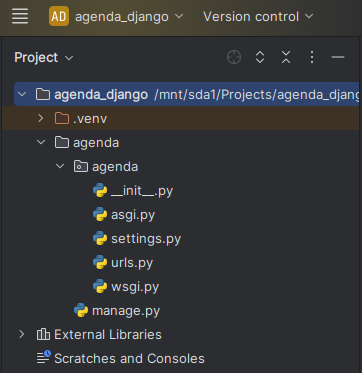
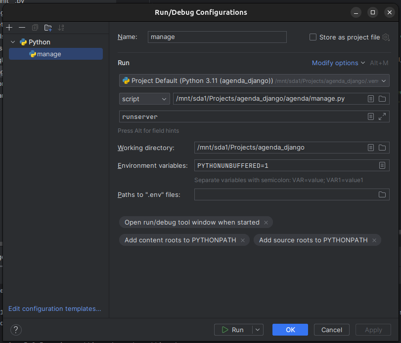
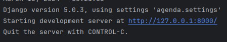
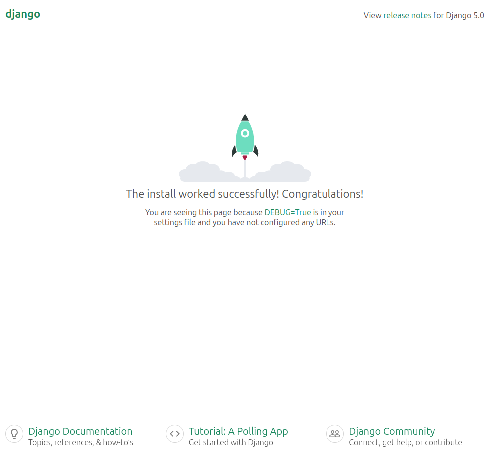
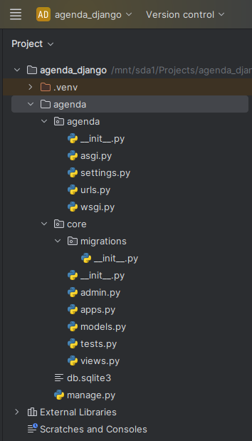

# Primeiros Passos

### Instalação

Como boas práticas, crie um ambiente virtual para o seu projeto. Após criado, ative o mesmo. Se você utiliza o PyCharm como IDE, no momento de criação de um novo projeto, ele já faz isso para você. Caso utilize VsCode ou outra IDE, leia este artigo aqui. ADICIONAR ARTIGO SOBRE AMBIENTES VIRTUAIS NO PYTHON.

A instalação do Django segue o padrão de outros frameworks e módulos python. No terminal utilize:

```bash
pip install django
```

### Criando um novo projeto

No terminal digite:

```bash
django-admin startproject nome_do_projeto
```

Isso fará com que o Django crie a estrutura básica de arquivos com o nome do seu projeto. No decorrer do artigo será abordada a função de cada arquivo.



Estrutura de arquivos do projeto no PyCharm

Observe que foi criado um arquivo chamado ‘manage.py’. Este é um dos arquivos principais do nosso projeto, pois será responsável por fazer a interface para rodar nosso servidor. Portanto, é importante fazer alguns ajustes na configuração do ambiente para que, seja executada de maneira mais prática o nosso servidor.

Na tela de edição de configurações Run/Debug do PyCharm faça as seguintes alterações:



- No campo ‘script’ coloque o caminho para o arquivo ‘manage.py’
- No campo ‘Script parameters’ adicione o texto ‘runserver’
- (opcional) Ajuste o nome para manage

Feito isso você estará apto a rodar o servidor. Se tudo estiver certo, você verá em seu ambiente local o link para acesso:



No link poderemos visualizar:



### Criando um novo app

O Django utiliza o conceito de apps para fazer a separação entre as aplicações em um mesmo projeto. Para o exemplo deste artigo, iremos utilizar somente um app, que iremos chamar de core. Porém, é possível criar diversos dentro do mesmo projeto, com o nome que você precisar.

No terminal, acesse o diretório do seu projeto e digite:

```bash
django-admin startapp core
```

Assim como na criação do projeto, este comando cria a estrutura de arquivos para o seu app.



Estrutura de arquivos do Projeto e App

Porém, o app ainda precisa ser ‘instalado’ no projeto. Para isso abra o arquivo ‘settings.py’ e procure a variável ‘INSTALLED_APPS’. Na última linha, inclua o nome do seu app. Deve ficar assim:

 

```python
INSTALLED_APPS = [
    'django.contrib.admin',
    'django.contrib.auth',
    'django.contrib.contenttypes',
    'django.contrib.sessions',
    'django.contrib.messages',
    'django.contrib.staticfiles',
    'core'
]
```

Agora que seu app está configurado, seguiremos com a criação do banco de dados.

[Banco de Dados](02_data_base.md)