# Banco de Dados

Uma das vantagens do Django é a integração nativa com diversos bancos de dados. Por padrão, o banco pré-configurado é o SQLite. Você pode criar seu esquema do zero, porém o Django traz diversas tabelas padronizadas que facilitam demais o início do seu projeto. 

## Tabelas Padrão

No terminal, dentro do diretório do seu projeto, digite:

```bash
python manage.py migrate
```

Este comando cria as tabelas padrão do Django. Entre elas, o painel de Administrador. Agora é possível acessar o painel presente em http://127.0.0.1:8000/

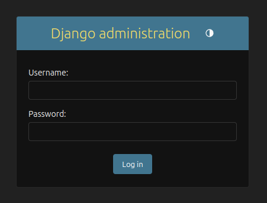

Porém, ainda não temos um usuário para logar nesta tela. Para criarmos um super usuário, no terminal digite:

```bash
python manage.py createsuperuser --username admin
```

Na sequência será solicitado um email padrão, e uma senha forte. Caso a senha não seja forte o suficiente, será mostrado um aviso em tela. 

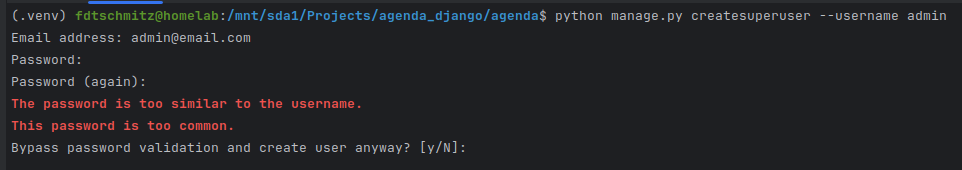

Como o objetivo é puramente didático, vou optar por manter a senha fraca digitando ‘y’.

Agora é possível logar e visualizar as opções disponíveis no momento.

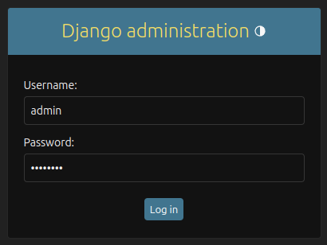

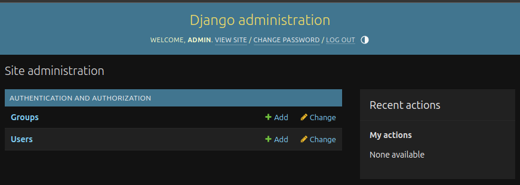

Por enquanto temos somente acesso à tela de criação de usuários e grupos. Porém, mais adiante, poderemos observer também o app criado.

Utilizando o Painel de Administrador, vamos criar mais alguns usuários e ver as opções disponíveis. Ao lado de User, clique em “+Add”. Informe um usuário e senha forte e clique em ‘Save’

Na tela seguinte, podemos adicionar Nome, Sobrenome e endereço de Email. Além disso, podemos alterar as permissões do usuário:

- Active - Determina se o usuário está ativo
- Staff status - Determina se o usuário pode logar no painel de Administrador
- Superuser status - Possui todas as permissões possíveis, assim como o Admin.

Ao término, clique em ‘Save’ para guardar alterações.

## Tabelas Personalizadas

Para quem já tem familiaridade com SQL, vai perceber que há uma diferença significativa na forma de estruturar as tabelas. Abordaremos estas diferenças e os motivos a seguir.

Para manipular nossa agenda, criaremos uma tabela ‘eventos’ contendo seus dados básicos:

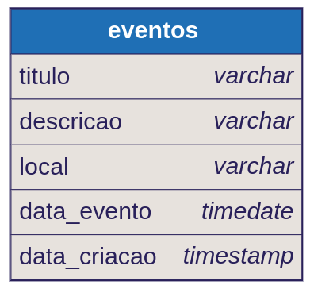

No diretório do seu app, abra o arquivo ‘models.py’. Aqui criaremos as tabelas personalizadas para este artigo. Seu código deverá estar desta forma:

```python
from django.db import models

# Create your models here.

class Evento(models.Model):
    titulo = models.CharField(max_length=100)
    descricao = models.TextField(blank=True, null=True)
    data_evento = models.DateTimeField()
    data_criacao = models.DateTimeField(auto_now=True)
```

Agora, para que esta classe representando uma tabela de fato seja transformada em uma tabela no banco, precisamos fazer a migração dessa tabela. No Terminal, digite:

```bash
python manage.py makemigrations core
```

Ao colocarmos o ‘core’ (nome do app) ao lado de ‘makemigrations’ estamos dizendo a aplicação para preparar somente as migrações do app ‘core’. Isso é importante caso existam mais de um app.

Se tudo estiver correto, dentro do diretório ‘migrations’, presente no diretório do seu app deve ter aparecido um novo arquivo chamado ‘0001_initial.py’. Seu conteúdo deve estar desta forma:

```python
from django.db import migrations, models

class Migration(migrations.Migration):

    initial = True

    dependencies = [
    ]

    operations = [
        migrations.CreateModel(
            name='Evento',
            fields=[
                ('id', models.BigAutoField(auto_created=True, primary_key=True, serialize=False, verbose_name='ID')),
                ('titulo', models.CharField(max_length=100)),
                ('descricao', models.TextField(blank=True, null=True)),
                ('data_evento', models.DateTimeField()),
                ('data_criacao', models.DateTimeField(auto_now=True)),
            ],
        ),
    ]
```

Verifique que, embora não tenhamos determinado uma ‘primary key’ na nossa classe Evento, o ‘django.db’ se encarregou de criar automaticamente uma ‘id’ com esta finalidade, adicionando também o parâmetro ‘auto_created=True’ para incrementar automáticamente.

Para preparar somente esta tabela para persistência no banco, vamos utilizar o seguinte comando no Terminal:

```bash
python manage.py sqlmigrate core 0001
```

Observe que foi impresso no terminal os comandos de SQL para criação desta tabela, que organizado deve ser algo assim:

```sql
BEGIN;
--
-- Create model Evento
--
CREATE TABLE "core_evento" (
	"id" integer NOT NULL PRIMARY KEY AUTOINCREMENT,
	"titulo" varchar(100) NOT NULL,
	"descricao" text NULL,
	"data_evento" datetime NOT NULL,
	"data_criacao" datetime NOT NULL);
COMMIT;
```

Observe também que no momento da preparação da tabela, o ‘django.db’ se encarregou de criar um nome para tabela juntando o nome do app. Caso você necessite determinar o nome da tabela, em ‘models.py’ você deve incluir a classe ‘Meta’:

```python
from django.db import models

# Create your models here.

class Evento(models.Model):
    titulo = models.CharField(max_length=100)
    descricao = models.TextField(blank=True, null=True)
    data_evento = models.DateTimeField()
    data_criacao = models.DateTimeField(auto_now=True)
    
    class Meta:
	    db_table = 'evento'
```

Como ainda não foi persistido no banco, podemos simplesmente excluir o arquivo ‘0001_initial.py’. Feito isso vamos novamente criar o arquivo de migração:

```bash
python manage.py makemigrations core
```

Desta vez o arquivo ficou levemente diferente:

```sql
from django.db import migrations, models

class Migration(migrations.Migration):

    initial = True

    dependencies = [
    ]

    operations = [
        migrations.CreateModel(
            name='Evento',
            fields=[
                ('id', models.BigAutoField(auto_created=True, primary_key=True, serialize=False, verbose_name='ID')),
                ('titulo', models.CharField(max_length=100)),
                ('descricao', models.TextField(blank=True, null=True)),
                ('data_evento', models.DateTimeField()),
                ('data_criacao', models.DateTimeField(auto_now=True)),
            ],
            options={
                'db_table': 'evento',
            },
        ),
    ]
```

Veremos como fica os comandos SQL. No Terminal:

```bash
python manage.py sqlmigrate core 0001
```

Na sequencia veremos algo como:

```sql
BEGIN;
--
-- Create model Evento
--
CREATE TABLE "evento" (
	"id" integer NOT NULL PRIMARY KEY AUTOINCREMENT,
	"titulo" varchar(100) NOT NULL,
	"descricao" text NULL,
	"data_evento" datetime NOT NULL,
	"data_criacao" datetime NOT NULL);
COMMIT;
```

Para persistirmos no banco de dados, utilizaremos o seguinte comando no Terminal:

```bash
python manage.py migrate core 0001
```

Se tudo ocorrer bem, você verá no terminal:

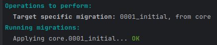

Feito isso, para utilizar essa tabela é necessário registrar em nossa aplicação. No diretório do seu app, abra o arquivo ‘admin.py’. Utilize o código a seguir:

```python
from django.contrib import admin
from core.models import Evento

# Register your models here.

admin.site.register(Evento)
```

Agora, ao rodarmos novamente o ‘manage.py’, e acessando o painel de Administrador ([http://127.0.0.1:8000/admin/](http://127.0.0.1:8000/admin/)) visualizaremos:

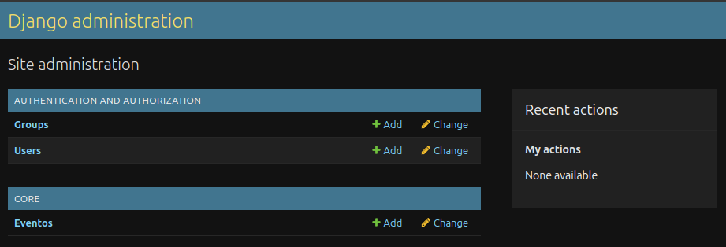

Em ‘Eventos’ será possível adicionar um novo. Clique em “+Add” e preencha como quiser e clique em Save.

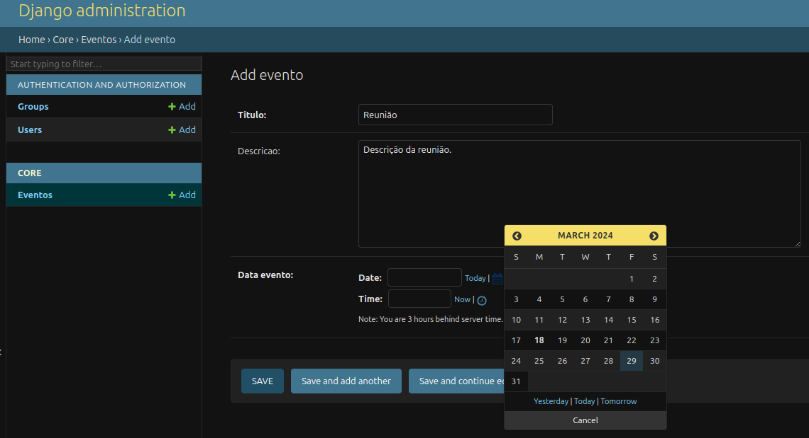

Observe que o evento aparece como “Evento object (1)”, pois, ainda não determinamos como este objeto deve ser tratado.

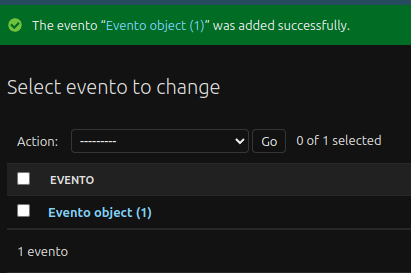

Para isso, abra novamente o arquivo ‘models.py’ e inclua na classe:

```python
class Evento(models.Model):
    titulo = models.CharField(max_length=100)
    descricao = models.TextField(blank=True, null=True)
    data_evento = models.DateTimeField()
    data_criacao = models.DateTimeField(auto_now=True)

    class Meta:
        db_table = 'evento'

    def __str__(self):
        return self.titulo
```

Atualizando o painel deveremos ver:

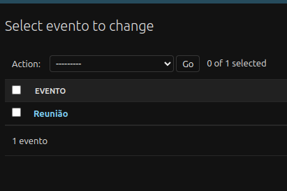

Vamos incluir mais alguns atributos para visualizar no painel. No arquivo ‘admin.py’, inclua a seguinte classe:

```python
from django.contrib import admin
from core.models import Evento

# Register your models here.

class EventoAdmin(admin.ModelAdmin):
    list_display = ('titulo', 'data_evento', 'data_criacao')

    
admin.site.register(Evento, EventoAdmin)
```

Novamente, atualizando o painel, deveremos ver algo como:

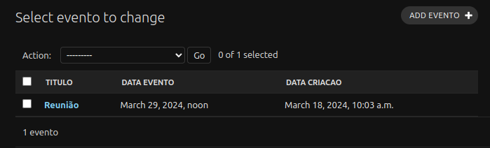

É possível também ajustar os títulos para deixá-los mais apresentáveis. Em ‘models.py’, inclua os parâmetros:

```python
class Evento(models.Model):
    titulo = models.CharField(max_length=100)
    descricao = models.TextField(blank=True, null=True)
    data_evento = models.DateTimeField(verbose_name='Data do evento')
    data_criacao = models.DateTimeField(auto_now=True, verbose_name='Data de Criação')
    
    class Meta:
        db_table = 'evento'

    def __str__(self):
        return self.titulo
```

Atualizando o painel:

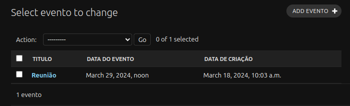

Agora iremos atribuir o evento a um usuário. Como já temos uma tabela de usuários padrão do Django, vamos utilizá-la para este projeto. Novamente em ‘models.py’ vamos criar uma chave estrangeira para ligarmos as duas tabelas:

```python
from django.db import models
from django.contrib.auth.models import User

# Create your models here.

class Evento(models.Model):
    titulo = models.CharField(max_length=100)
    descricao = models.TextField(blank=True, null=True)
    data_evento = models.DateTimeField(verbose_name='Data do evento')
    data_criacao = models.DateTimeField(auto_now=True, verbose_name='Data de Criação')
    usuario = models.ForeignKey(User, on_delete=models.CASCADE)
    
    class Meta:
        db_table = 'evento'

    def __str__(self):
        return self.titulo
```

Com a criação de uma chave estrangeira (Foreign Key) precisamos atualizar o relacionamento em nosso banco de dados. No Terminal:

```bash
python manage.py makemigrations core
```

Porém, esbarramos em um problema. Como se trata de um campo onde não podem existir valores núlos e já haviam registros no banco, ele precisa saber o que fazer com os registros existentes:

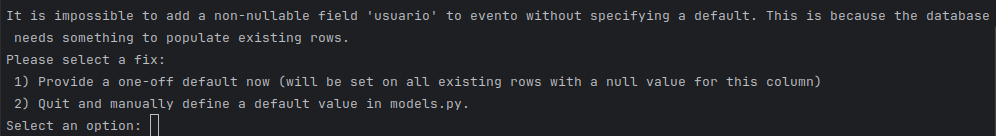

Por hora vamos utilizar a opção numero 1. Feito isso, vamos colocar também o número 1 como opção padrão deste momento. Assim o ‘admin’ será o usuário dos eventos registrados.

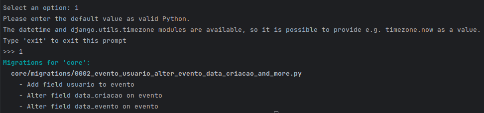

Ainda no Terminal utilize:

```bash
python manage.py sqlmigrate core 0002
```

Deveremos ver o seguinte comando SQL:

```sql
BEGIN;
--
-- Add field usuario to evento
--
CREATE TABLE "new__evento" (
	"id" integer NOT NULL PRIMARY KEY AUTOINCREMENT,
	"usuario_id" integer NOT NULL REFERENCES "auth_user" ("id") DEFERRABLE INITIALLY DEFERRED,
	"titulo" varchar(100) NOT NULL,
	"descricao" text NULL, "data_evento" datetime NOT NULL,
	"data_criacao" datetime NOT NULL);
INSERT INTO "new__evento" (
	"id", "titulo", "descricao", "data_evento", "data_criacao", "usuario_id")
	SELECT "id", "titulo", "descricao", "data_evento", "data_criacao",
	1 FROM "evento";
DROP TABLE "evento";
ALTER TABLE "new__evento" RENAME TO "evento";
CREATE INDEX "evento_usuario_id_344a595f" ON "evento" ("usuario_id");
--
-- Alter field data_criacao on evento
--
-- (no-op)
--
-- Alter field data_evento on evento
--
-- (no-op)
COMMIT;
```

Observe que para criação do novo relacionamento, o ‘django.db’ faz diversas operações no banco:

- Cria uma nova tabela chamada ‘new_evento’ com os dados da tabela evento incluindo a coluna de chave estrangeira
- Copia o conteúdo da tabela ‘evento’ para a nova tabela, atribuindo o padrão que havíamos escolhido para a chave estrangeira
- Exclui a tabela ‘evento’
- Renomeia ‘new_evento’ para ‘evento’.
- Cria um índice para o usuário

Agora vamos persistir essas alterações no banco:

```bash
python manage.py migrate core 0002
```

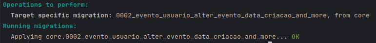

Atualizando nosso painel agora é possível ver nossas alterações:

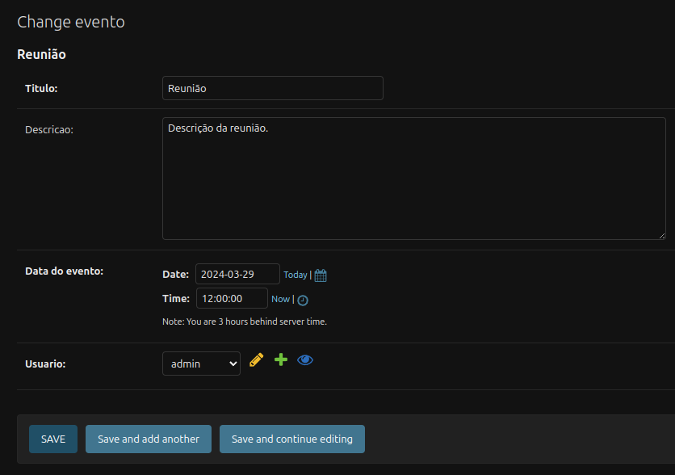

Vamos criar mais um evento:

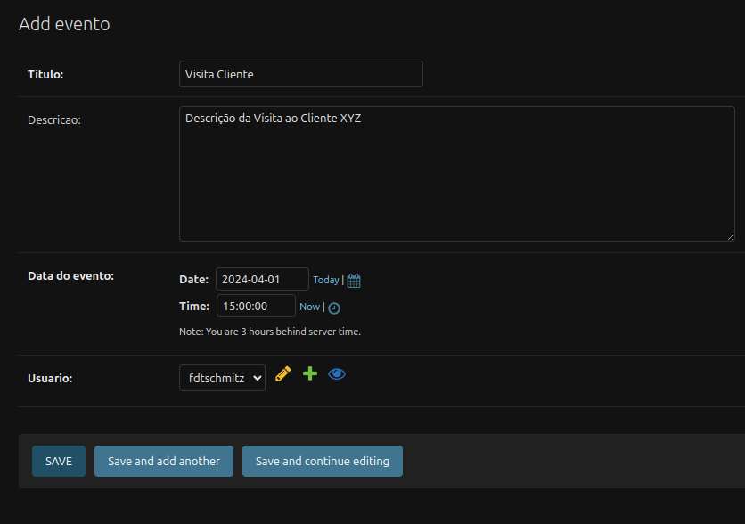

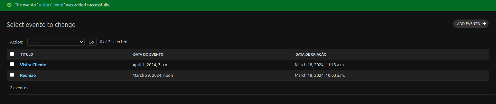

Em ‘admin.py’ podemos incluir um filtro para facilitar a visualização. Faça estas alterações na classe:

```python
class EventoAdmin(admin.ModelAdmin):
    list_display = ('titulo', 'data_evento', 'data_criacao', 'usuario')
    list_filter = ('usuario',)

admin.site.register(Evento, EventoAdmin)
```

Atualizando nosso painel, deveremos ver:

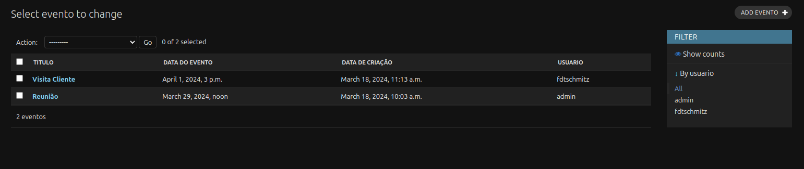

É possível selecionar outros campos para o filtro, como o título ou Data do evento.

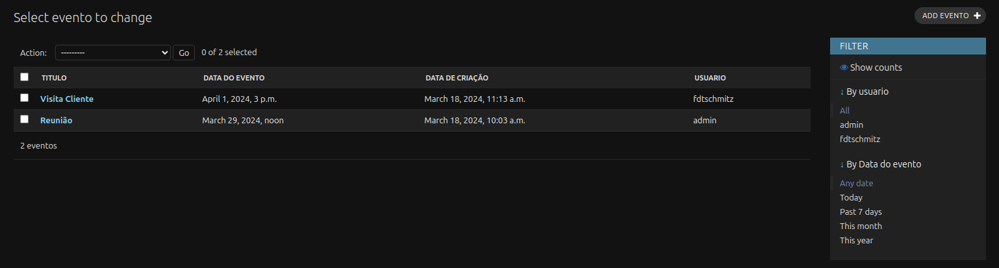

Com o nosso banco pronto, podemos criar uma [Página de listagem](03_listing_page.md).