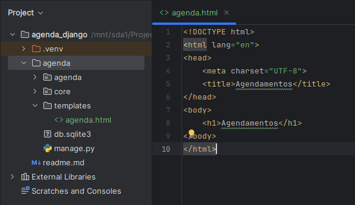

# Página de listagem

### Templates

O Django oferece em seus modelos de templates a capacidade de se utilizar expressões Python no HTML. Desta forma é possível mostrar informações e realizar comandos como IF e FOR.

Primeiramente precisamos criar nosso diretório de templates. Dentro do diretório do projeto, crie uma pasta chamada ‘Templates”. Agora dentro dela crie um arquivo html, que chamaremos de ‘agenda.html’.



Com o nosso diretório criado, precisamos registrar o caminho. Abra o arquivo ‘settings.py’ e procure a constante ‘TEMPLATES’. O código deverá ficar como abaixo:

```python
#Não esqueça de importar o modulo os:
import os

TEMPLATES = [
    {
        'BACKEND': 'django.template.backends.django.DjangoTemplates',
        'DIRS': [os.path.join(BASE_DIR, 'templates')],
        'APP_DIRS': True,
        'OPTIONS': {
            'context_processors': [
                'django.template.context_processors.debug',
                'django.template.context_processors.request',
                'django.contrib.auth.context_processors.auth',
                'django.contrib.messages.context_processors.messages',
            ],
        },
    },
]
```

Agora, abra o arquivo ‘views.py’ dentro do diretório core e inclua a função abaixo:

```python
from django.shortcuts import render

# Create your views here.

def lista_eventos(request):
    return render(request, 'agenda.html')
```

Precisamos criar uma rota para acessar a página que acabamos de criar. Para isso, dentro do diretório ‘agenda’ abra o arquivo ‘urls.py’ e inclua o código abaixo:

```python
from django.contrib import admin
from django.urls import path
from core import views

urlpatterns = [
    path('admin/', admin.site.urls),
    path('agenda/', views.lista_eventos)
]
```

Agora, rodando nossa aplicação, é possível acessar ‘[http://127.0.0.1:8000/agenda/](http://127.0.0.1:8000/agenda/)’ e visualizar a página que criamos:


### Listando Eventos

Em ‘views.py’ vamos ajustar o código para incluir uma busca no banco de dados:

```python
from django.shortcuts import render
from core.models import Evento

# Create your views here.

def lista_eventos(request):
		usuario = request.user
		#Utilizando este filtro, o usuário somente visualizará os eventos em seu usuário.
    evento = Evento.objects.filter(usuario=usuario)
    dados = {'eventos': evento}
    return render(request, 'agenda.html', dados)
```

Precisamos ajustar também o arquivo html para poder listar o eventos, conforme abaixo:

```html
<!DOCTYPE html>
<html lang="en">
<head>
    <meta charset="UTF-8">
    <title>Agendamentos</title>
</head>
<body>
    <h1>Agendamentos</h1>

    <ul>
    
        <li>{{ evento.titulo }} - {{ evento.data_evento }}</li>
    
    </ul>

</body>
</html>
```

Agora, ao acessarmos a página agenda, é isso que visualizamos:


A data e horário ainda estão em um formato estranho. Vamos corrigir isso. Abra o arquivo ‘models.py’ e faça o seguinte ajuste na classe:

```python
class Evento(models.Model):
    titulo = models.CharField(max_length=100)
    descricao = models.TextField(blank=True, null=True)
    data_evento = models.DateTimeField(verbose_name='Data do evento')
    data_criacao = models.DateTimeField(auto_now=True, verbose_name='Data de Criação')
    usuario = models.ForeignKey(User, on_delete=models.CASCADE)

    class Meta:
        db_table = 'evento'

    def __str__(self):
        return self.titulo
        
		# Inclua esta função na classe:
    def get_data_evento(self):
        return self.data_evento.strftime('%d/%m/%Y %H:%M')
```

Feito isso, precisamos ajustar o nosso html:

```python
<!DOCTYPE html>
<html lang="en">
<head>
    <meta charset="UTF-8">
    <title>Agendamentos</title>
</head>
<body>
    <h1>Agendamentos</h1>

    <ul style="font-size: 18px">
    
        <li>{{ evento.titulo }} - {{ evento.get_data_evento }}</li>
    
    </ul>

</body>
</html>
```

### Model Page, Header e Footer

Na prática comum de desenvolvimento web, é vantajoso separar as páginas em modelos de página, cabeçalho e rodapé. Essa abordagem, comumente aplicada em padrões arquiteturais como MVC ou MVVM, oferece uma clara divisão de responsabilidades, permitindo a reutilização eficiente de código, facilitando a manutenção e promovendo a consistência visual em todo o site. Ao organizar o conteúdo dessa maneira, é possível garantir uma estrutura coesa, escalável e de fácil gerenciamento para projetos web.

Dentro de templates, crie três novos arquivos: ‘model-page.html’, ‘model-header.html’ e ‘model-footer.html’.

Em ‘model-page.html’ vamos utilizar o seguinte código:

```html
<!DOCTYPE html>
<html lang="en">
<head>
    
</head>
<body>
     
    
</body>
</html>
```

No arquivo ‘model-header.html’, o código fica mais simples:

```html
    <meta charset="UTF-8">
    <title>Agenda</title>
    <h1>Agenda</h1>
```

Já no arquivo ‘model-footer.html’ você pode, por exemplo, colocar sua assinatura:

```html
<p>Desenvolvido por SEUNOMEAQUI</p>
```

Agora precisamos ajustar o arquivo ‘agenda.html’, pois não é mais necessário o cabeçalho e rodapé do arquivo. Ajuste desta forma:

```html



    <h3>Agendamentos</h3>

    <ul style="font-size: 18px">
    
        <li>{{ evento.titulo }} - {{ evento.get_data_evento }}</li>
    
    </ul>

```

Nossa página agora ficou desta forma:


Agora, quando quisermos criar outros blocos de conteúdo, somente precisamos criar o arquivo com o ‘block content’, uma vez que o header e o footer seguem padronizados.

Antes de finalizar este tópico vamos ajustar a página de entrada. Para isso, vamos incluir na ‘urlpatterns’ em ‘urls.py’:

```python
#Não esqueça de incluir nas importações o módulo RedirectView:
from django.views.generic import RedirectView

urlpatterns = [
    path('admin/', admin.site.urls),
    path('agenda/', views.lista_eventos),
    path('', RedirectView.as_view(url='/agenda/'))
]
```

Feito. Agora ao acessar ‘http://127.0.0.1:8000/’ seremos direcionados para a página ‘http://127.0.0.1:8000/agenda'.

No próxim tópico trabalharemos com [Autenticação, Login e Decoradores](04_authentication.md)