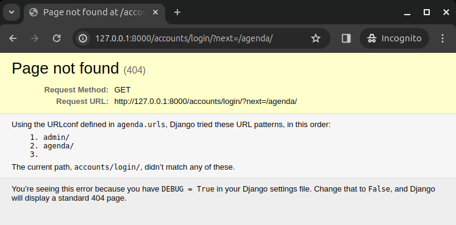

# Autenticação, Login e Decoradores

O Django possui um pacote voltado para autenticação e o gerenciamento de usuários em seu projeto, chamado 'django.contrib.auth'. Ele inclui modelos de banco de dados, views de autenticação, APIs para gerenciar usuários e grupos, permissões e sinais para interceptar eventos de autenticação. Junto a este pacote, o Django conta também com alguns decoradores como o ‘@login_required’, que garante que apenas usuários autenticados acessem a view protegida.

Vamos abordar algumas destas funções e integrar em nosso projeto agenda.

### login_required

Em ‘views.py’ vamos incluir o decorador ‘@login_required’ para forçar o login de usuário antes de acessar ‘/agenda’:

```python
from django.shortcuts import render
from core.models import Evento
from django.contrib.auth.decorators import login_required
# Create your views here.

@login_required
def lista_eventos(request):
    usuario = request.user
    evento = Evento.objects.filter(usuario=usuario)
    dados = {'eventos': evento}
    return render(request, 'agenda.html', dados)
```

Agora se o seu usuário não estiver logado no painel de Administração ele verá uma tela de erro ao acessar a agenda:



Vamos criar uma tela de login para corrigir isso. 

### Login

Em ‘urls.py’, ajuste a urlpatterns:

```python
urlpatterns = [
    path('admin/', admin.site.urls),
    path('agenda/', views.lista_eventos),
    path('', RedirectView.as_view(url='/agenda/')),
    path('login/', views.login_user)
]
```

Vamos ajustar agora ‘views.py’ e incluir a função de login. Além disso, em ‘@login_required’ vamos incluir um redirecionador:

```python
def login_user(request):
    return render(request, 'login.html')

@login_required(login_url='/login/')
def lista_eventos(request):
    usuario = request.user
    evento = Evento.objects.filter(usuario=usuario)
    dados = {'eventos': evento}
    return render(request, 'agenda.html', dados)
```

Em ‘templates’ crie um novo arquivo chamado ‘login.html’. Embora não seja o objetivo deste artigo, irei utilizar um pouco de estilização para centralizar o formulário de login:

```html
<!DOCTYPE html>
<html lang="en">
<head>
    <meta charset="UTF-8">
    <title>Agenda</title>
</head>
<body>
    <h1>Login</h1>
    <form action="submit" method="POST">
        <div align="center">
            <div style="display: block;">
                <label>Usuário:</label>
                <input type="text" name="username">
            </div>
            <div style="display: block;">
                <label>Password:</label>
                <input type="password" name="password">
            </div>
            <button type="submit">Entrar</button>
        </div>
    </form>
</body>
</html>
```

Observe que o ‘form’ adiciona a action “submit” a url. Portanto, precisamos criar esse caminho em ‘urls.py’:

```python
urlpatterns = [
    path('admin/', admin.site.urls),
    path('agenda/', views.lista_eventos),
    path('', RedirectView.as_view(url='/agenda/')),
    path('login/', views.login_user),
    path('login/submit', views.submit_login)
]
```

Agora em ‘views.py’ precisamos criar a função adequada. Seu arquivo deverá estar assim:

```python
from django.shortcuts import render, redirect
from core.models import Evento
from django.contrib.auth.decorators import login_required
from django.contrib.auth import authenticate, login
# Create your views here.

def login_user(request):
    return render(request, 'login.html')

def submit_login(request):
    if request.POST:
        username = request.POST.get('username')
        password = request.POST.get('password')
        usuario = authenticate(username=username, password=password)
        if usuario is not None:
            login(request, usuario)
            return redirect('/')
    else:
        return redirect('/')

@login_required(login_url='/login/')
def lista_eventos(request):
    usuario = request.user
    evento = Evento.objects.filter(usuario=usuario)
    dados = {'eventos': evento}
    return render(request, 'agenda.html', dados)
```

Vamos testar nosso login. Digite seu usuário e senha e tente logar.


Deve apresentar um erro:


Isso nos diz que o sistema está sentindo falta de um token CSRF para fazer a autenticação. Vamos corrigir isso. Em ‘login.html’, ao lado do ‘form’ inclua o seguinte código:

```html
<form action="submit" method="POST">
```

Com isso, ao tentar logar, você deverá ser redirecionado corretamente:


### Logout

Agora que conseguimos logar em nosso sistema, precisamos também adicionar uma função de logout. Primeiramente em nosso ‘model-header.html’ vamos incluir o link para logout:

```html
<meta charset="UTF-8">
<title>Agenda</title>
<div align="right">
    <a href="/logout">logout</a>
</div>
<h1>Agenda</h1>
```

Em ‘urls.py’ atualize a variavel ‘urlpatters’:

```python
urlpatterns = [
    path('admin/', admin.site.urls),
    path('agenda/', views.lista_eventos),
    path('', RedirectView.as_view(url='/agenda/')),
    path('login/', views.login_user),
    path('login/submit', views.submit_login),
    path('logout/', views.logout_user)
]
```

E em ‘views.py’ inclua a função:

```python
#Inclua o módulo logout em importações:
from django.contrib.auth import authenticate, login, logout

def logout_user(request):
    logout(request)
    return redirect('/')
```

Se tudo estiver correto, agora você poderá efetuar o logout sem problemas:


### Senha Inválida

Por enquanto, na tela de login, se você errar a senha, será redirecionado para uma tela de erro:


Para tratarmos este problema, em ‘views.py’ vamos incluir o tratamento na função ‘submit_login’:

```python
from django.contrib import messages

def submit_login(request):
    if request.POST:
        username = request.POST.get('username')
        password = request.POST.get('password')
        usuario = authenticate(username=username, password=password)
        if usuario is not None:
            login(request, usuario)
            return redirect('/')
        else:
            messages.error(request, "Usuário ou senha inválido")
    return redirect('/')
```

Vamos incluir também na tela de login:

```html
<!DOCTYPE html>
<html lang="en">
<head>
    <meta charset="UTF-8">
    <title>Agenda</title>
</head>
<body>
    <h1>Login</h1>
    <form action="submit" method="POST">
        <div align="center">
            <div style="display: block;">
                <label>Usuário:</label>
                <input type="text" name="username">
            </div>
            <div style="display: block;">
                <label>Password:</label>
                <input type="password" name="password">
            </div>
            <button type="submit">Entrar</button>
        </div>
    </form>
    <div align="center">
        
            <strong>Erro: </strong>{{ message }}
        
    </div>
</body>
</html>
```

Agora, se a senha estiver errada, será apresentado o erro:


Com o nosso Login e Logout funcionando, precisamos de uma tela para inserir os dados em nossa agenda. Este será o tema a seguir: [Inserção de Dados](05_data_inserts.md)