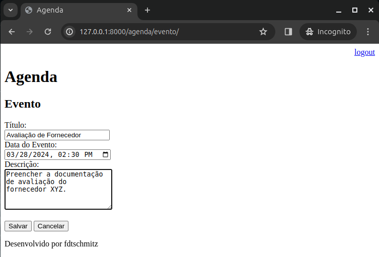

# Inserção de Dados

Até então as únicas entradas que fizemos no banco de dados foram feitas dentro do painel de Administração. Porém, somente o admin deverá ter acesso a esse painel. Portanto, precisamos criar uma página para inserção de dados.

Primeiramente, vamos criar a rota para tela de cadastro em ‘agenda/evento’. Atualize em ‘urls.py’:

```python
urlpatterns = [
    path('admin/', admin.site.urls),
    path('agenda/', views.lista_eventos),
    path('agenda/evento/', views.evento),
    path('', RedirectView.as_view(url='/agenda/')),
    path('login/', views.login_user),
    path('login/submit', views.submit_login),
    path('logout/', views.logout_user)
]
```

Depois em ‘views.py’, inclua a função:

```python
@login_required(login_url='/login/')
def evento(request):
    return render(request, 'evento.html')
```

Agora precisamos criar o template para inclusão do evento. Vamos chamar o arquivo de ‘evento.html’.

```html




<h2>Evento</h2>
<form action="submit" method="POST">
    <label>Título:</label>
    <br>
        <input type="text" name="titulo" size="23">
    <br>
    <   label>Data do Evento:</label>
    <br>
        <input type="datetime-local" name="data_evento">
    <br>
        <label>Descrição:</label>
    <br>
        <textarea name="descricao" rows="5" cols="24"></textarea>
    <br><br>
        <button type="submit">Salvar</button>
    <a href="/">
        <button type="submit">Cancelar</button>
    </a>
</form>

```

Para facilitar o acesso à tela de Eventos, vamos criar um botão na tela de Agendamentos. Atualize o arquivo ‘agenda.html’ com:

```html



    <h3>Agendamentos</h3>
    <a href="evento/">
        <button type="button">Novo Evento</button>
    </a>
    <ul style="font-size: 18px">
    
        <li>{{ evento.titulo }} - {{ evento.get_data_evento }}</li>
    
    </ul>

```

Precisamos criar agora a rota para salvar no nosso banco de dados o formulário que criamos no Evento. Primeiramente em ‘urls.py’, inclua a rota:

```python
urlpatterns = [
    path('admin/', admin.site.urls),
    path('agenda/', views.lista_eventos),
    path('agenda/evento/', views.evento),
    path('agenda/evento/submit', views.submit_evento),
    path('', RedirectView.as_view(url='/agenda/')),
    path('login/', views.login_user),
    path('login/submit', views.submit_login),
    path('logout/', views.logout_user)
]
```

Agora em ‘views.py’ inclua a função:

```python
@login_required(login_url='/login')
def submit_evento(request):
    if request.POST:
        titulo = request.POST.get('titulo')
        data_evento = request.POST.get('data_evento')
        descricao = request.POST.get('descricao')
        usuario = request.user
        Evento.objects.create(titulo=titulo,
                              data_evento=data_evento,
                              descricao=descricao,
                              usuario=usuario)
    return redirect('/')
```

Vamos testar nossa aplicação. Crie um novo evento:



Clique em “Salvar”. Se tudo ocorrer bem, você deverá voltar a tela de Agendamentos e visualizar o evento que acabou de salvar:


Antes de seguirmos com o próximo tópico, vamos incluir mais um campo em eventos a fim de salvar também o local. Este campo poderá ser branco e nulo.

### Adicionando um novo campo

Primeiramente precisamos criar essa coluna em nossa tabela no banco. Em ‘models.py’ atualize a classe conforme abaixo:

```python
class Evento(models.Model):
    titulo = models.CharField(max_length=100)
    descricao = models.TextField(blank=True, null=True)
    local = models.TextField(blank=True, null=True)
    data_evento = models.DateTimeField(verbose_name='Data do evento')
    data_criacao = models.DateTimeField(auto_now=True, verbose_name='Data de Criação')
    usuario = models.ForeignKey(User, on_delete=models.CASCADE)

    class Meta:
        db_table = 'evento'

    def __str__(self):
        return self.titulo

    def get_data_evento(self):
        return self.data_evento.strftime('%d/%m/%Y - %H:%M hrs')
```

Feito isso, vamos preparar a migração para o banco. No Terminal:

```bash
python manage.py makemigrations core

# Confira o numero do seu arquivo em migrations

python manage.py sqlmigrate core 0003
```

Logo você verá a seguinte mensagem:

```sql
BEGIN;
--
-- Add field local to evento
--
ALTER TABLE "evento" ADD COLUMN "local" text NULL;
COMMIT;
```

Agora vamos concluir a migração para o banco:

```bash
python manage.py migrate core 0003
```

Se tudo correr bem, você verá no Terminal:


Com isso, podemos atualizar nossos templates para exibir o local. Vamos começar com ‘agenda.html’:

```html



    <h3>Agendamentos</h3>
    <a href="evento/">
        <button type="button">Novo Evento</button>
    </a>
    <ul style="font-size: 18px">
    
        <li>{{ evento.titulo }} - {{ evento.get_data_evento }} - {{ evento.local }}</li>
    
    </ul>

```

Depois vamos atualizar o ‘evento.html’:

```html




<h2>Evento</h2>
<form action="submit" method="POST">
    <label>Título:</label>
    <br>
        <input type="text" name="titulo" size="23">
    <br>
        <label>Data do Evento:</label>
    <br>
        <input type="datetime-local" name="data_evento">
    <br>
        <label>Descrição:</label>
    <br>
        <textarea name="descricao" rows="5" cols="24"></textarea>
    <br>
        <label>Local:</label>
    <br>
        <textarea name="local" rows="2" cols="24"></textarea>
    <br>
    <br><br>
        <button type="submit">Salvar</button>
</form>
    <a href="/">
        <button type="submit">Cancelar</button>
    </a>

```

Agora que é possível incluir dados, possibilitaremos também a [Alteração e Exclusão de Dados](06_data_edit.md)