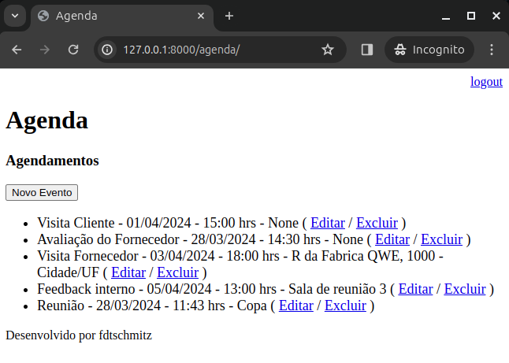

# Alteração e Exclusão de Dados

No tópico anterior abordamos como incluir os dados. Neste tópico iremos reaproveitar o mesmo template para alteração, além de criar as rotas para edição e exclusão.

Em ‘urls.py’ vamos criar a rota de exclusão. Inclua conforme abaixo:

```python
urlpatterns = [
    path('admin/', admin.site.urls),
    path('agenda/', views.lista_eventos),
    path('agenda/evento/', views.evento),
    path('agenda/evento/submit', views.submit_evento),
    path('agenda/evento/delete/<int:id_evento>/', views.delete_evento),
    path('', RedirectView.as_view(url='/agenda/')),
    path('login/', views.login_user),
    path('login/submit', views.submit_login),
    path('logout/', views.logout_user)
]
```

Feito isso, em ‘views.py’, crie a função ‘delete_evento’:

```python
@login_required(login_url='/login')
def submit_evento(request):
    if request.POST:
        titulo = request.POST.get('titulo')
        data_evento = request.POST.get('data_evento')
        descricao = request.POST.get('descricao')
        local = request.POST.get('local')
        usuario = request.user
        Evento.objects.create(titulo=titulo,
                              data_evento=data_evento,
                              descricao=descricao,
                              local=local,
                              usuario=usuario)
    return redirect('/')
```

Precisamos agora de um botão executar essa ação. Vamos ajustar o arquivo ‘agenda.html’:

```html



    <h3>Agendamentos</h3>
    <a href="evento/">
        <button type="button">Novo Evento</button>
    </a>
    <ul style="font-size: 18px">
    
        <li>
            {{ evento.titulo }} - {{ evento.get_data_evento }} - {{ evento.local }}
            ( <a href="#">Editar</a>
            / <a href="evento/delete/{{ evento.id }}/">Excluir</a> )
        </li>
    
    </ul>

```

Salve e teste a aplicação. Agora é possível excluir os registros diretamente da tela Agendamentos, apenas clicando em “Excluir”.




Agora que conseguimos excluir os registros, precisamos poder editar. Observe no código HTML, que deixamos um “#” no link de ‘Editar’. Não será necessário criar uma rota nova, pois iremos aproveitar a mesma rota de inclusão de registro. Ainda em ‘agenda.html’, ajuste o arquivo conforme abaixo:

```html



    <h3>Agendamentos</h3>
    <a href="evento/">
        <button type="button">Novo Evento</button>
    </a>
    <ul style="font-size: 18px">
    
        <li>
            {{ evento.titulo }} - {{ evento.get_data_evento }} - {{ evento.local }}
            ( <a href="evento/?id={{ evento.id }}">Editar</a>
            / <a href="evento/delete/{{ evento.id }}/">Excluir</a> )
        </li>
    
    </ul>

```

Ao clicar em “Editar” seremos redirecionados para tela de inserção de eventos com o ID do evento selecionado. Agora precisamos editar a função de tratamento. Em ‘views.py’:

```python
@login_required(login_url='/login/')
def evento(request):
    id_evento = request.GET.get('id')
    dados = {}
    if id_evento:
        dados['evento'] = Evento.objects.get(id=id_evento)
    return render(request, 'evento.html', dados)
```

Antes de editarmos nossa página de evento, precisamos incluir uma função em ‘models.py’, para ajustar a string de data que será exibida na tela de edição. Inclua dentro da classe ‘Evento’ a função abaixo:

```python
def get_data_input_evento(self):
    return self.data_evento.strftime('%Y-%m-%dT%H:%M')
```

Agora será necessário também ajustar o arquivo ‘evento.html’:

```python




<h2>Evento</h2>
<form action="submit" method="POST">
    <input type="number" name="id_evento" value="{{ evento.id }}" hidden>
    <label>Título:</label>
    <br>
        <input type="text" name="titulo" size="23" value="{{ evento.titulo }}">
    <br>
        <label>Data do Evento:</label>
    <br>
        <input type="datetime-local" name="data_evento" value="{{ evento.get_data_input_evento }}">
    <br>
        <label>Descrição:</label>
    <br>
        <textarea name="descricao" rows="5" cols="24">{{ evento.descricao }}</textarea>
    <br>
        <label>Local:</label>
    <br>
        <textarea name="local" rows="2" cols="24">{{ evento.local }}</textarea>
    <br>
    <br><br>
        <button type="submit">Salvar</button>
</form>
    <a href="/">
        <button type="submit">Cancelar</button>
    </a>

```

Se você testar a aplicação agora, verá que ao clicar em “Salvar” você acaba criando um novo evento ao invés de editar o antigo. Vamos ajustar esse tratamento em ‘views.py’, na função ‘submit_evento’:

```python
@login_required(login_url='/login')
def submit_evento(request):
    if request.POST:
        titulo = request.POST.get('titulo')
        data_evento = request.POST.get('data_evento')
        descricao = request.POST.get('descricao')
        local = request.POST.get('local')
        usuario = request.user
        id_evento = request.POST.get('id_evento')
        if id_evento:
            evento = Evento.objects.get(id=id_evento)
            if evento.usuario == usuario:
                evento.titulo = titulo
                evento.descricao = descricao
                evento.data_evento = data_evento
                evento.local = local
                evento.save()
        else:
            Evento.objects.create(titulo=titulo,
                                  data_evento=data_evento,
                                  descricao=descricao,
                                  local=local,
                                  usuario=usuario)
    return redirect('/')
```

Desta forma, antes de efetuar a alteração, é verificado se o usuário que está editando é o mesmo que criou o evento. Agora podemos editar nossos eventos:


Com isso nossa aplicação já executa todas as operações básicas: criação, edição e exclusão. Estamos chegando na reta final deste artigo, onde iremos incluir [Filtros, Responses e Configurações](07_filter_response.md)