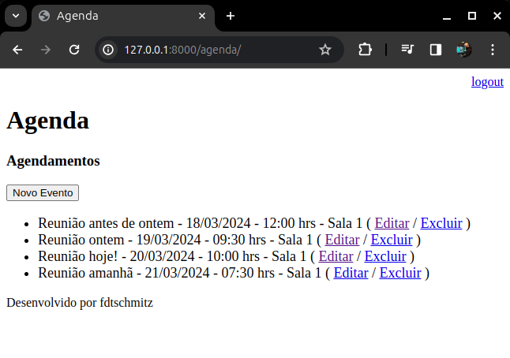

# Filtros, Responses e Configurações

Para encerrar nosso artigo, vamos abordar alguns filtros mais elaborados. Também iremos tratar erros com responses e configurar o Timezone.

### Timezone

A fim de evitar conflitos em configurações com as datas, é necessário ajustar em nosso servidor. No diretório do nosso projeto, vamos ajustar o arquivo ‘settings.py’. Procure a constante “LANGUAGE_CODE” e ajuste conforme abaixo:

```python
LANGUAGE_CODE = 'pt-br'

TIME_ZONE = 'America/Sao_Paulo'

USE_I18N = True

USE_TZ = False
```

### Debug Mode

Ainda dentro de ‘settings.py’ podemos encontrar também a configuração que altera o estado do modo de Debug. Durante o estudo podemos manter o Debug ligado. Porém, em produção é de extrema importância que este modo permaneça desligado. Para fazer isso, procure a constante DEBUG. Para desligar altere para “False”. Além disso, precisamos determinar quais rotas estão permitidas. Para liberar todas coloque um ‘*’ na lista.

```python
# SECURITY WARNING: don't run with debug turned on in production!
DEBUG = False

ALLOWED_HOSTS = ['*']
```

### Eventos Passados

Com a configuração atual da nossa função ‘lista_eventos’, mesmo eventos que já ocorreram ainda seguem listados, pois o filtro é apenas em usuário. 

```python
evento = Evento.objects.filter(usuario=usuario)
```



A fim de ocultar eventos passados, precisamos incluir um filtro de data. Em ‘view.py’, vamos ajustar a função ‘lista_eventos’:

```python
#Incluir na linha de importação:
from datetime import datetime, timedelta

@login_required(login_url='/login/')
def lista_eventos(request):
    usuario = request.user
    data_atual = datetime.now() - timedelta(hours=1)
    evento = Evento.objects.filter(usuario=usuario,
                                   data_evento__gt=data_atual)
    dados = {'eventos': evento}
    return render(request, 'agenda.html', dados)
```

Como não é possível incluir no filtro comparações como > ou <, utilizamos o sufixo “__gt” (great than, ou maior que). Na [documentação oficial](https://docs.djangoproject.com/en/5.0/ref/models/querysets/#gt) você encontra mais sobre esta ou outras Querysets.

Agora ao acessar a página você verá somente os compromissos que irão acontecer até 1 hora antes do evento.


### Eventos Atrasados

Vamos ajustar agora nossa Agenda para exibir os eventos atrasados em vermelho. Em ‘models.py’ vamos incluir uma nova função em “Eventos”:

```python
#Incluir na linha de importação:
from datetime import datetime

def get_evento_atrasado(self):
    if self.data_evento < datetime.now():
        return True
    else:
        return False
```

Feito isso é necessário ajustar a página ‘agenda.html’:

```html



    <h3>Agendamentos</h3>
    <a href="evento/">
        <button type="button">Novo Evento</button>
    </a>
    <ul style="font-size: 18px">
    
        <li>
            <div style=
                            "color:red"
                        >
                {{ evento.titulo }} - {{ evento.get_data_evento }} - {{ evento.local }}
                ( <a href="evento/?id={{ evento.id }}">Editar</a>
                / <a href="evento/delete/{{ evento.id }}/">Excluir</a> )
            </div>
        </li>
    
    </ul>

```

Com isso os eventos atrasados agora são mostrados em vermelho na página de agenda.


### Responses

Para tratar erros na operação ou até mesmo evitar que o usuário force operações indevidas, vamos incluir um tratamento adequado. Em ‘views.py’ atualize a função ‘delete_evento’.

```python
#Incluir na linha de importação
from django.http.response import Http404

@login_required(login_url='/login')
def delete_evento(request, id_evento):
    usuario = request.user
    try:
        evento = Evento.objects.get(id=id_evento)
    except Exception:
        raise Http404()
    if usuario == evento.usuario:
        evento.delete()
    else:
        raise Http404()
    return redirect('/')
```

Agora, por exemplo, se o usuário forçar o acesso a um evento que não é dele, haverá uma tela de erro específica:


Outra opção no tratamento de responses é o módulo ‘JsonResponse’. Para exemplificar este módulo, vamos criar uma lista em json a partir de uma rota específica. Em ‘urls.py’, inclua a rota:

```python
urlpatterns = [
    path('admin/', admin.site.urls),
    path('agenda/', views.lista_eventos),
    path('agenda/lista/', views.json_lista_evento),
    path('agenda/evento/', views.evento),
    path('agenda/evento/submit', views.submit_evento),
    path('agenda/evento/delete/<int:id_evento>/', views.delete_evento),
    path('', RedirectView.as_view(url='/agenda/')),
    path('login/', views.login_user),
    path('login/submit', views.submit_login),
    path('logout/', views.logout_user)
]
```

Depois em ‘views.py’, crie a função abaixo:

```python
#Inclua na linha de importação:
from django.http.response import Http404, JsonResponse

@login_required(login_url='/login/')
def json_lista_evento(request):
    usuario = request.user
    evento = Evento.objects.filter(
        usuario=usuario).values(
        'id', 'titulo', 'data_evento',
        'descricao', 'local', 'usuario')
    return JsonResponse(list(evento), safe=False)
```

Agora, ao acessar a rota ‘http://127.0.0.1:8000/agenda/lista/’ temos o seguinte retorno:


Para finalizar, vamos transformar essa rota em uma espécie de api para integração com outras aplicações. Primeiramente vamos remover a necessidade de login para essa função. Depois vamos ajustar para solicitar o id de usuário. Sua função deve ficar como abaixo:

```python
#Inclua na linha de importação:
from django.contrib.auth.models import User

def json_lista_evento(request, id_usuario):
    usuario = User.objects.get(id=id_usuario)
    evento = Evento.objects.filter(
        usuario=usuario).values(
        'id', 'titulo', 'data_evento',
        'descricao', 'local')
    return JsonResponse(list(evento), safe=False)
```

Em ‘urls.py’ é necessário incluir também o id na rota:

```python
urlpatterns = [
    path('admin/', admin.site.urls),
    path('agenda/', views.lista_eventos),
    path('agenda/lista/<int:id_usuario>/', views.json_lista_evento),
    path('agenda/evento/', views.evento),
    path('agenda/evento/submit', views.submit_evento),
    path('agenda/evento/delete/<int:id_evento>/', views.delete_evento),
    path('', RedirectView.as_view(url='/agenda/')),
    path('login/', views.login_user),
    path('login/submit', views.submit_login),
    path('logout/', views.logout_user)
]
```

Ao acessar a rota ‘http://127.0.0.1:8000/agenda/lista/1/’, por exemplo, temos o seguinte retorno:


Usando uma extensão para facilitar a leitura de json (no Chrome, JSON Viewer):


# Conclusão

Ao longo deste artigo, exploramos o desenvolvimento de uma aplicação de Agenda completa com Django, desde a instalação e configuração até funcionalidades avançadas como autenticação de usuários, filtros personalizados e configurações especiais. Através dessa jornada, você pôde observar a versatilidade e o poder do Django para criar aplicações web robustas e escaláveis.

Com este conhecimento, você estará pronto para iniciar seus próprios projetos com Django. Explore a vasta comunidade online, utilize a documentação oficial e busque tutoriais específicos para aprofundar seus conhecimentos em áreas de interesse.

Lembre-se: o desenvolvimento web é um processo contínuo de aprendizado e aprimoramento. Continue explorando, experimentando e se desafiando para criar aplicações cada vez mais complexas e inovadoras com Django.